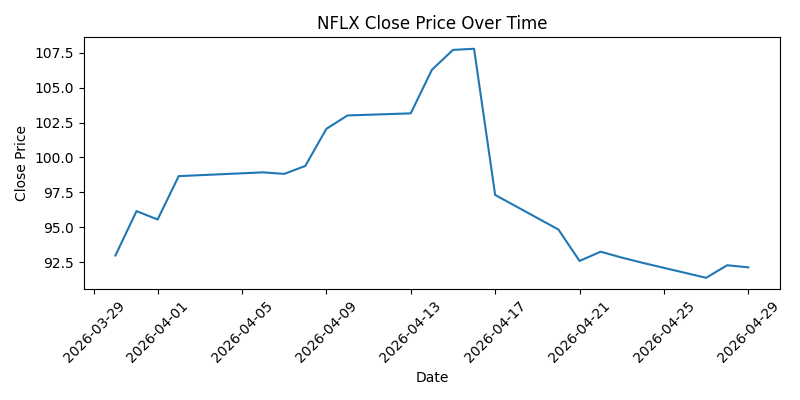
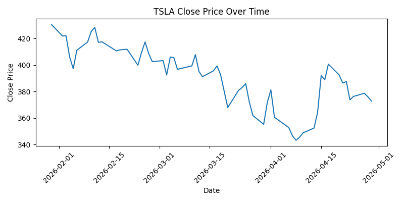
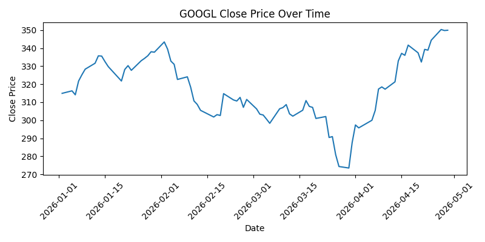
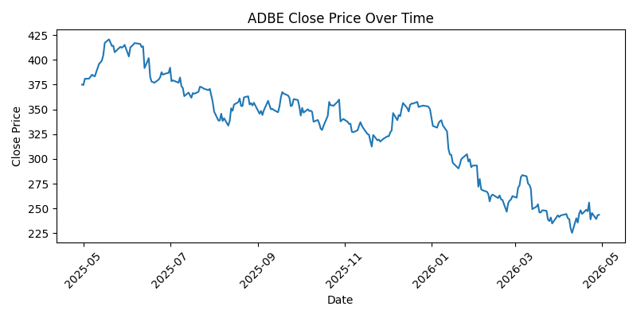
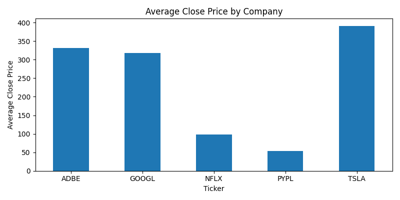
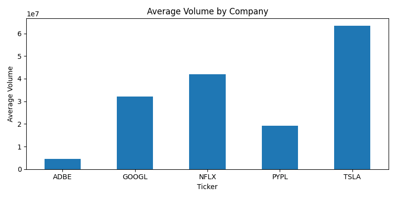

# Data Card: NASDAQ Stock Price Dataset

## 1. Source of Data
This dataset was collected using the Yahoo Finance API through the `yfinance` Python library.

The dataset contains daily stock price data for five NASDAQ-listed companies:
- Netflix (NFLX)
- Tesla (TSLA)
- PayPal (PYPL)
- Alphabet / Google (GOOGL)
- Adobe (ADBE)

Each company was downloaded using a different time period:
- NFLX: 1 month
- TSLA: 3 months
- PYPL: 6 months
- GOOGL: year-to-date
- ADBE: 1 year

The dataset includes the following variables:
- Date
- Open
- High
- Low
- Close
- Volume
- Ticker
- Period

## 2. Descriptive Overview
The final dataset contains 541 rows and 8 columns.

There are no missing values in the dataset, which shows a strong level of completeness.

I used descriptive statistics and visualizations to better understand the behavior of stock prices and trading volume for the selected companies.

## 3. Visualizations and Results

### Netflix (NFLX) Close Price Over Time

This chart shows that Netflix had some fluctuations during the selected period, but the overall price level stayed within a relatively limited range. The movement was more moderate compared to some of the other companies.

### Tesla (TSLA) Close Price Over Time

Tesla shows the highest price levels among the selected companies. The chart also shows stronger variability, which suggests more noticeable changes in price during the selected period.

### PayPal (PYPL) Close Price Over Time

PayPal had the lowest price range among the selected companies. Its chart is useful to see that not all companies in the dataset behave at similar price levels.

### Alphabet / Google (GOOGL) Close Price Over Time

Google shows a relatively stable pattern compared to Tesla. Even though there are changes over time, the general trend appears more balanced.

### Adobe (ADBE) Close Price Over Time

Adobe also has a high price level, although below Tesla in average terms. The chart shows variation over the one-year period, but without extreme jumps.

### Average Close Price by Company

This bar chart makes the comparison between companies easier. Tesla has the highest average closing price, while PayPal has the lowest. Adobe and Google are in the middle-high range, and Netflix is clearly below them but above PayPal.

### Average Volume by Company

This chart compares average trading activity. Tesla and Netflix show higher average volume, meaning they were traded more actively in the selected periods. Adobe has the lowest average volume among the five companies.

## 4. KPI Results
- Completeness: 100.00%
- Latency: 0 day(s)
- Accuracy: 100.00%
- Consistency: 100.00%

## 5. KPI Explanation
**Completeness** checks whether the dataset contains missing values. In this case, there are no missing values, so completeness is 100%.

**Latency** checks how recent the dataset is by comparing the latest date in the dataset with the current date. In this project, the latency is 0 days.

**Accuracy** was evaluated with internal validation rules. I checked that:
- High is greater than or equal to Low
- Open is between Low and High
- Close is between Low and High
- Volume is not negative

All checks were satisfied, so the accuracy result is 100%.

**Consistency** checks whether the dataset has the correct structure, suitable data types, and no duplicate records for the same Date and Ticker. All these conditions were satisfied, so consistency is 100%.

## 6. Conclusion
Overall, the dataset has strong quality for basic financial analysis.

It is complete, up to date, accurate according to the internal checks, and consistent in structure. The visualizations also help show clear differences between the selected companies in terms of stock price and trading activity.

For this reason, I consider this dataset suitable for a simple financial analysis and for demonstrating data quality KPIs.